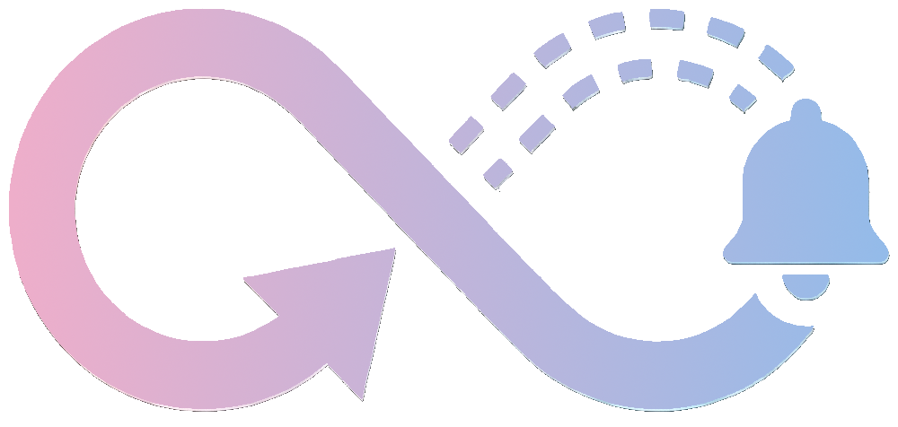

<p align="center">
  
</p>
<h1 align="center">Detach</h1>
<p align="center">
  Mobile-first UI for managing AI coding agents while remaining in the driving seat.
</p>

## Description

A web-based progressive web app that connects to a remote sandbox where AI agents (currently only Claude Code) execute coding tasks.
After each task finishes, a notification is received and it's possible to review, refine and commit the changes from the mobile app itself.

## Components

- **Webview** - Frontend (HTML/CSS/JS) with xterm.js terminal and Git UI
- **Bridge** - Go WebSocket server that connects browser to sandbox
- **Sandbox** - Ubuntu container with SSH, development tools, and Git

## Prerequisites

- Docker & Docker Compose

## Quick Start

**Local development:**
```bash
make setup           # Generate keys and .env (one-time)
docker compose up    # Start all services
                     # Open the URL shown by make setup (includes auth token)
```

**Manual setup:** Copy `.env.example` to `.env` and customize values, then run `docker compose up`.

**Production:** Use `./install.sh` for interactive setup with deploy keys and HTTPS.

## SSH Keys

Keys are stored in `keys/` and **not committed to git**. They're generated by `make setup` (dev) or `install.sh` (production).

| Key | Purpose |
|-----|---------|
| `bridge` / `bridge.pub` | Bridge → Sandbox SSH connection |
| `deploy_key` / `deploy_key.pub` | Sandbox → GitHub authentication |

**For private repos:** Add `keys/deploy_key.pub` as a deploy key on your GitHub repository (Settings → Deploy keys) with write access if you need to push.

## Authentication

Detach uses secure token-based authentication for pairing devices with your instance. The token is auto-generated on first startup and displayed in the logs with a QR code for easy mobile pairing.

**Skip authentication (local development only):**
Set `SKIP_AUTHENTICATION=1` (or `true`, `yes`) to disable authentication. Any other value keeps authentication enabled. This is insecure and should only be used for local development.

See [docs/authentication.md](docs/authentication.md) for complete authentication specification.

## Push Notifications

Detach can send push notifications to your device when tasks complete or require approval. Requires VAPID keys (generated during `install.sh` setup).

See [docs/notifications.md](docs/notifications.md) for setup and configuration.

## Ports

- `8080` - Web UI
- `8081` - WebSocket bridge
- `2222` - Sandbox SSH (for debugging)

## Development

```bash
# Rebuild after changes
docker-compose build --no-cache bridge webview
docker-compose up -d

# View logs
docker logs detach-bridge
docker logs detach-webview
docker logs detach-sandbox

# SSH into sandbox for debugging
ssh -i keys/bridge -p 2222 detach-dev@localhost
```

## Architecture

```
Browser (xterm.js)
    ↓ WebSocket
Bridge (Go)
    ↓ SSH
Sandbox (Ubuntu + dev tools)
```

## VPS Deployment

For deploying to a VPS for nightly testing or production:

### Provision infrastructure
1. **Provision VPS** with `infrastructure/vps-config.yaml` as cloud-init
2. **Setup GitHub Deploy Key**: See [infrastructure/README.md](infrastructure/README.md)

### Configure and deploy

Set the required environment variables for deployment scripts:

| Variable | Required | Description |
|----------|----------|-------------|
| `DETACH_REMOTE_HOST` | Yes | VPS IP or hostname |
| `DETACH_REMOTE_USER` | No | SSH user (defaults to current user) |
| `DETACH_DEPLOY_DIR` | No | Deploy directory (defaults to `/home/$USER/detach`) |

```bash
export DETACH_REMOTE_HOST=your-vps-ip-or-hostname
./deploy.sh             # Deploy via git pull
./deploy.sh --rsync     # Deploy uncommitted local changes
```

See [infrastructure/README.md](infrastructure/README.md) for complete deployment guide.

### Access
- **Development**: `http://localhost:8080`
- **VPS**: `http://<vps-ip>:8080`

## Disclaimer

This is a hobby project and is provided as-is. While I've tried to follow security best practices, I have not thoroughly vetted the code. Run it at your own risk. I don't provide support, maintenance, or accept feature requests. Forks and contributions are welcome.
